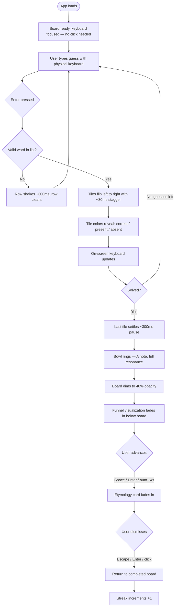
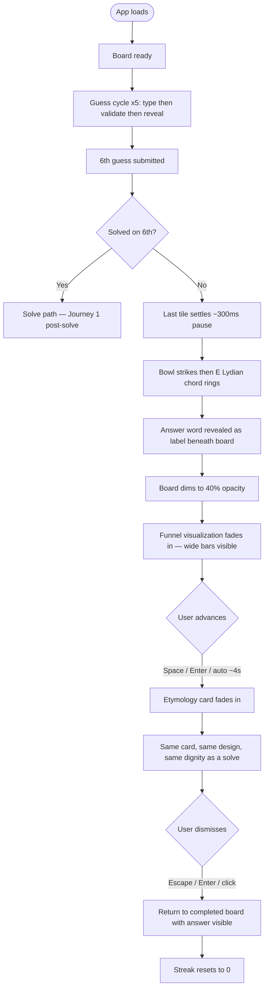
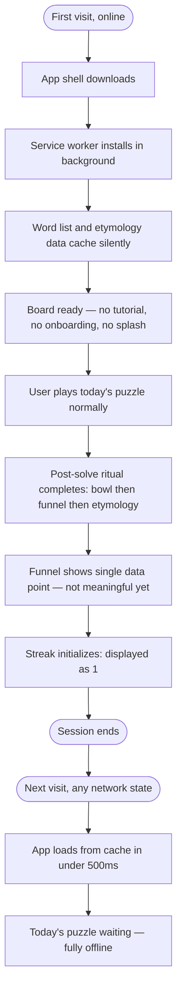
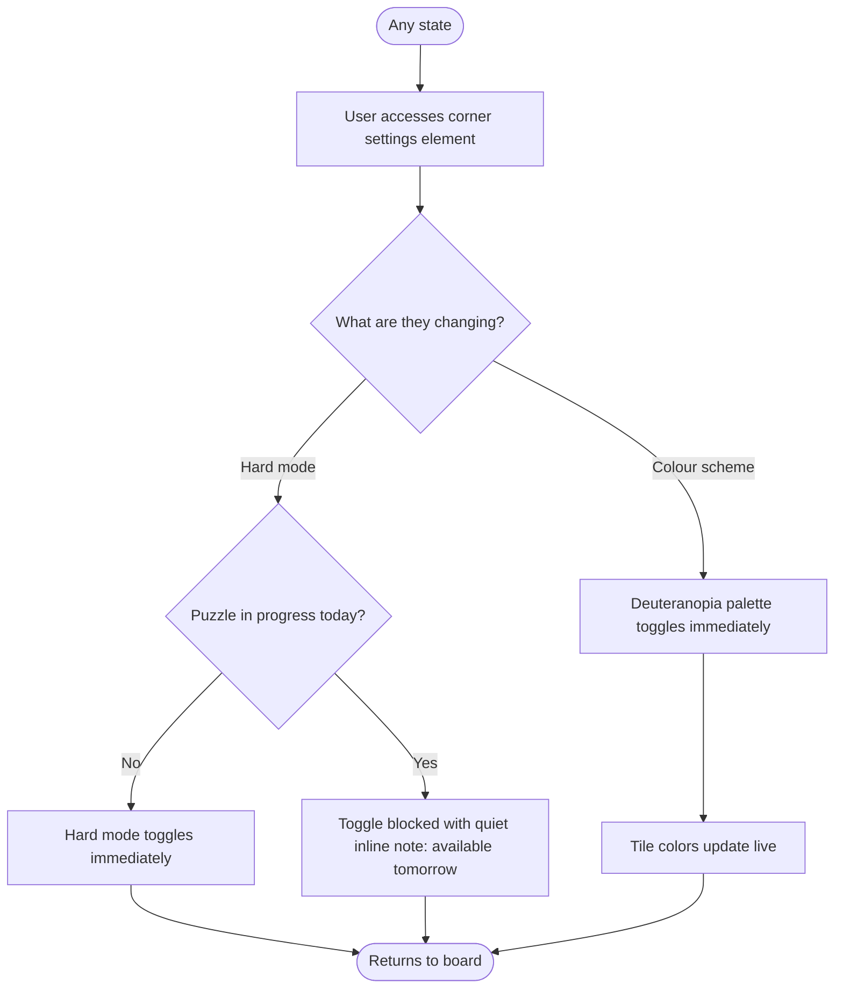

# UX Design Specification knightro-wordle

**Author:** Lord Farquaad
**Date:** 2026-03-18

---

<!-- UX design content will be appended sequentially through collaborative workflow steps -->

## Executive Summary

### Project Vision

Myrdl is a personal daily word puzzle built as a private practice ritual for a single user. The core loop — solve, review funnel, read etymology — is the complete product. Features go *inward* (self-improvement, reflection) not outward (sharing, competition). The funnel is not a stats screen; it is a mirror of how the user thinks under constraint. Myrdl shows you how you think, not just whether you won.

### Target Users

#### Primary User: Lord Farquaad (sole user)

- Treats the daily solve as a private act of mastery — the UX must feel worthy of that ritual
- Deliberate and methodical; values self-improvement over competition
- Desktop Chrome, morning routine, Wordle-fluent — no tutorial needed
- Zero tolerance for friction, social patterns, or celebration-adjacent UI

### Key Design Challenges

1. **Post-solve ritual transition** — The funnel and etymology must feel like natural, reflective closure — not a reward screen or modal. Tone: quiet, analytical, meditative.
2. **Funnel as visual shape** — The solution-space story must be readable at a glance through visual form (narrowing silhouette or proportional bars), not raw numbers. The *shape* of the solve — or the fail — tells the story before a digit is read.
3. **Phase transition choreography** — The solve → funnel → etymology transitions are ritual moments. Too abrupt breaks the spell; too animated disrupts the reflective tone. The transitions themselves are part of the experience.
4. **Intentional absence** — The lack of social features must feel like a philosophical stance, not an omission. Every design decision should communicate: *this is yours alone.*
5. **Analytical dignity on failure** — A failed solve is a vocabulary gap made visible, not a punishment. The design treats the failed funnel with the same calm, analytical respect as a successful one. No red, no X, no shame.

### Design Opportunities

1. **Funnel as signature visual** — Unique to Myrdl. A narrowing silhouette or proportional bar form makes guess efficiency readable as shape. Wide bars = hard word; fast taper = sharp technique.
2. **Sound as ritual punctuation — A / E Lydian:**
   - **Solve:** A bowl, single note, full resonance — clean, grounded, complete
   - **Fail:** A bowl strike resolving to E Lydian chord (E, G#, A#, B) — otherworldly, open, curious; the raised fourth encodes *mystery remains*, not defeat
   - The A→E fifth is memorizable; after a week, the note *is* the result — felt before it's processed
   - Implementation: 2 short audio clips, same bowl source, composed or pitch-shifted
3. **Etymology card as moment of stillness** — At peak post-solve engagement, one well-presented piece of vocabulary enrichment. Design it like a page in a good book.
4. **"Terse and lovely" as the design test** — For every post-solve element: *does this feel like a meditation bowl, or does it feel like confetti?* The meditation bowl is the north star.

## Core User Experience

### Defining Experience

The core of Myrdl is typing a guess. That single action — thinking of a word, typing it, watching the tiles flip — is the entire product in miniature. Every other decision in the design serves the quality of that moment.

After the last guess, the product takes over. The user doesn't navigate to a results screen; the ritual sequence runs itself: bowl rings → funnel appears → etymology card settles. The user's only job is to receive.

### Platform Strategy

| Dimension | Decision |
| --- | --- |
| **Platform** | Web (desktop Chrome, primary) |
| **Input** | Physical keyboard first; on-screen keyboard available |
| **Offline** | PWA, fully offline after first load — the app is always ready |
| **Layout** | Desktop-first; mobile not broken but not optimized |
| **Hosting** | Static deployable; no server, no backend |

The keyboard is the primary interface. The design must ensure the keyboard is always active — no click-to-focus, no input mode switching, no friction between a thought and a letter on the board.

### Effortless Interactions

- **Opening the app:** No load state, no splash, no greeting. The board is there. Today's puzzle is waiting.
- **Typing a guess:** Physical keyboard input registers immediately. No focus management needed. Backspace works. Enter submits.
- **Tile feedback:** Flip animation completes before the user has fully processed the result — fast enough to feel instant, slow enough to be readable.
- **Post-solve transition:** Automatic. The bowl rings and the sequence begins. The user makes no navigational decision.
- **Etymology dismissal:** One key or click. No confirmation. Back to the completed board.

### Critical Success Moments

1. **The tile flip** — Immediate, satisfying feedback. The most-repeated interaction in the product; must feel right every single time.
2. **The bowl ring** — The sensory boundary between gameplay and reflection. A solve: A resonates, clean and final. A fail: the E Lydian chord lifts, open and curious.
3. **The funnel renders** — The shape of the solve is readable in under 3 seconds without reading a number. Wide bars or narrow taper — the story is visual first.
4. **The etymology card** — One word, one origin, presented like a sentence in a good book. Reads in 10 seconds. Stays with you.

### Experience Principles

1. **The board is the whole world** — During the solve, nothing else exists. No distractions, no chrome, no UI outside the board and keyboard.
2. **The ritual sequence is automatic** — After the last guess, Myrdl leads. The user follows. No navigation required between solve, funnel, and etymology.
3. **Shape before data** — Visual communication precedes numerical. The funnel, the board state, the streak — all should be readable by form before text is processed.
4. **One thing at a time** — Solve, then funnel, then etymology. Never simultaneously. The sequence *is* the experience.
5. **The sound is the transition** — The bowl ring is not feedback; it is the UX transition mechanic from play to reflection. It marks time.

## Desired Emotional Response

### Primary Emotional Goals

The master emotional target for Myrdl is **quiet capability** — the feeling of a craftsperson reviewing their own work. Not triumph, not entertainment, not social validation. The user should finish each daily ritual feeling self-aware and grounded: *I see how I think. I did this.*

Supporting emotional register:

- **Equanimity** — the same calm presence on a failed solve as a successful one
- **Curiosity** — awakened by the etymology card and, on harder days, by the fail itself
- **Groundedness** — the ritual has a shape; completing it settles the morning

### Emotional Journey Mapping

| Moment | Target Feeling | Anti-pattern to Avoid |
| --- | --- | --- |
| Opening the app | Familiarity, readiness — *here is my thing* | Splash screens, greetings, onboarding friction |
| During the solve | Focused tension — productive constraint | Distractions, unclear board state, input anxiety |
| Solve moment | Release, groundedness — the work is done | Confetti, fanfare, over-celebration |
| Funnel review | Analytical calm, self-awareness | Numbers without shape, over-explanation |
| Etymology card | Small curiosity, minor discovery | Popups, interruptions, wall-of-text |
| Closing | Completeness — the ritual is finished | Cliffhangers, push notifications, "come back" hooks |
| Failed solve | Equanimity, curiosity — *interesting* | Shame, red UI, punitive visual language |
| Returning tomorrow | Quiet anticipation | Streak pressure, fire emojis, anxiety UI |

### Micro-Emotions

- **Confidence, not confusion** — board state is always readable; game rules are never ambiguous
- **Trust, not skepticism** — the funnel must feel accurate and fair; the data earns belief
- **Accomplishment, not frustration** — a good solve feels earned; input never fights the user
- **Equanimity, not shame** — failure is information, not judgment
- **Occasional delight** — an etymology card that genuinely surprises; not required daily, but worth the moment when it lands

### Design Implications

| Emotional Goal | UX Design Approach |
| --- | --- |
| Quiet capability | Funnel visualized as shape — respects user intelligence, no hand-holding |
| Groundedness | Minimal palette, consistent rhythm, bowl sound as temporal anchor |
| Equanimity on failure | Same visual treatment as success; no punitive color; E Lydian says *curious*, not *wrong* |
| Focus during solve | Nothing outside the board; full visual attention; zero ambient UI noise |
| Curiosity | Etymology at peak post-solve engagement; E Lydian's raised fourth is audibly unresolved |
| Trust in the funnel | Visual proportionality must be accurate; bars should encode real word-count ratios |

### Emotional Design Principles

1. **Quiet > Loud** — Every emotional beat is understated. The bowl, not the fanfare. The shape, not the number. The card, not the popup.
2. **Failure is information** — The design never encodes judgment into a failed solve. The E Lydian chord is the sound of a word that lived in a different dimension today.
3. **Ritual rhythm creates safety** — The consistent sequence (solve → bowl → funnel → etymology) is itself an emotional anchor. Predictability is comfort for a daily practice.
4. **Earn the delight** — Moments of genuine surprise (a fascinating etymology, a clean funnel taper) land harder because they're not manufactured. Don't force delight; let it occur.
5. **The streak is protection, not pressure** — Streak UI should feel like something worth guarding, not a countdown to failure. The number is calm. There is no fire.

## UX Pattern Analysis & Inspiration

### Inspiring Products Analysis

#### myNoise.net — The Personal Instrument

**What it does well:** Feels like a tool built by one person who uses it themselves, for users who care about the specifics. The UI is dense but calm — every element is purposeful, nothing decorative. Dark, muted palette with controls as the only color. No onboarding, no social layer, no gamification. Poetic naming gives utilitarian function emotional texture. You arrive and use it. It feels like a private instrument you have configured for yourself.

**The feeling to transfer:** A crafted object, not a consumer product. Made with care, for a user who cares.

#### Gmail Keyboard Shortcuts — Expert Flow

**What it does well:** The entire application is operable at the speed of thought for a keyboard user. Nothing interrupts the keyboard flow. `?` reveals the full shortcut map on demand — it teaches when asked, never when not. Power users never touch the mouse. The depth is there if you want it; invisible if you don't.

**The pattern to transfer:** The daily Myrdl ritual — guess, bowl, funnel, etymology, return to board — is completable entirely via keyboard. The depth is available; it never announces itself.

#### Miro Boards — Peripheral Controls, Central Canvas

**What it does well:** The working area is the screen. Tools live at the edges in a minimal glanceable layer — visible without competing. Contextual UI appears near what you're working on, then retreats. The canvas is never crowded by its own controls.

**The pattern to transfer:** The board is the canvas. Settings, streak, and hard mode toggle live in a small, calm corner element. During gameplay, nothing competes with the board.

### Transferable UX Patterns

#### Aesthetic & Tone

- Dark or muted base palette; controls and tiles provide the only color (myNoise)
- Poetic, craft-quality naming and text — the etymology card, error states, empty states all deserve care (myNoise)
- The app feels personal and configured, not generic and default (myNoise)

#### Interaction

- Full keyboard operability: guess input → `Enter` submits, `Space`/`Enter` advances post-solve sequence, `Escape` returns to board (Gmail)
- Shortcut discoverability via `?` key — available, never intrusive (Gmail)
- Peripheral UI: streak, settings, hard mode in a minimal corner element that doesn't crowd the board (Miro)
- Controls available on demand; the primary surface stays clean (Miro)

#### Information Hierarchy

- The working area owns the screen; everything else is edge (Miro)
- Depth for expert users without burdening new users (Gmail)

### Anti-Patterns to Avoid

- **Dense homepage syndrome** (myNoise inverse) — the game view is sacred; complexity lives elsewhere, never on the board
- **Gamification/marketing interruptions** (Gmail's Promotions tab, social nudges) — no upsells, no "share this", no "invite a friend" surfaces anywhere
- **Social pressure UI** (Miro's "invite collaborators" CTA) — Myrdl is a solo instrument; no collaborative affordances, not even vestigially

### Design Inspiration Strategy

**Adopt directly:**

- Dark/muted base palette with tiles and funnel bars as the primary color source
- Keyboard-first interaction model for the entire ritual sequence
- Peripheral UI for controls; the board owns the screen during gameplay

**Adapt:**

- myNoise's "personal instrument" aesthetic → applied to a game board rather than a sound mixer; same sense of *this is configured for me*
- Gmail's shortcut depth → scoped to the tight ritual sequence rather than a full application; simpler map, same discoverability principle

**Avoid entirely:**

- Any UI pattern that implies an audience (share buttons, result cards formatted for screenshots, streak displays with urgency encoding)
- Onboarding flows — the board teaches itself; Lord Farquaad already knows Wordle
- Loading states during normal use — the PWA cache makes this unnecessary; design should never show a spinner after first load

## Design System Foundation

### Design System Choice

**Tailwind CSS** — utility-first CSS framework, all components hand-crafted.

No component library. Every visual element in Myrdl (game tiles, funnel bars, etymology card, keyboard, streak display) is bespoke by nature and built from scratch. Tailwind provides the utility layer: spacing, typography, color tokens, responsive helpers.

### Rationale for Selection

- **No imposed aesthetic** — pre-built component libraries (Material, Ant Design) carry a visual language that directly conflicts with the myNoise-inspired personal instrument feel; Tailwind has no opinion about what anything looks like
- **Design token control** — the entire palette, typography scale, and spacing system lives in `tailwind.config.js` as a single source of truth
- **Solo developer speed** — utility classes eliminate context-switching between HTML and CSS files; fast iteration on a small, focused component set
- **Minimal bundle** — Tailwind's purge step removes all unused classes; critical for a fast-loading PWA where first-load performance matters
- **No runtime overhead** — static CSS output; no CSS-in-JS runtime cost

### Implementation Approach

All UI components built as custom elements styled with Tailwind utilities:

| Component | Notes |
| --- | --- |
| Game board & tiles | Custom; tile flip animation via CSS transitions |
| On-screen keyboard | Custom; mirrors physical keyboard layout |
| Funnel visualization | Custom SVG or CSS bar chart; proportional to real word counts |
| Etymology card | Custom; typographic composition, no library components |
| Streak / settings corner | Minimal custom layout; peripheral to board |

### Customization Strategy

Define a custom Tailwind theme in `tailwind.config.js`:

- **Color palette:** Dark base (near-black background), muted neutrals for inactive tiles, semantic colors for tile states (correct, present, absent), deuteranopia-safe alternatives
- **Typography:** A single serif or humanist sans for etymology card prose; monospace or geometric sans for tile letters and data
- **Spacing scale:** Tight and consistent — the board has a fixed logical size; spacing tokens ensure rhythm
- **Animation:** Custom transition durations for tile flip (deliberate, not instant) and post-solve sequence entries (calm, not bouncy)

## Core Interaction Design

### The Defining Interaction

> "Type a guess, watch the tiles reveal — then see how you think."

Myrdl's defining experience is the tile submission and reveal cycle. It is the most repeated interaction in the product — up to six times per session, every day. If this moment feels exactly right, the rest of the ritual is earned. If it feels wrong, nothing downstream recovers it.

The post-solve ritual sequence (bowl → funnel → etymology) is Myrdl's invention. But it is built on the foundation of a Wordle tile flip that feels correct. That is the thing to get right.

### User Mental Model

The user arrives as a Wordle expert. No rules need teaching. The board and keyboard are self-explanatory. The mental model to establish is a single extension of what they already know:

> *The game doesn't end when I solve it. The ritual continues.*

The bowl ring is the signal that the game has ended and something else has begun. The first few sessions establish this: bowl → funnel → etymology. After a week, the expectation is conditioned. The ritual has a shape that the user anticipates.

### Success Criteria for Core Interaction

- A typed letter appears on the tile immediately — zero perceptible lag
- The tile flip sequence reads as deliberate and satisfying — tiles reveal left to right with a short stagger (~80ms between tiles), total flip duration ~400ms per tile
- An invalid word shakes gently and rejects cleanly — no harsh sound, no red, just a brief physical signal
- After the last guess, the bowl rings before any visual change — sound leads, visuals follow
- The funnel shape is readable as a narrative in under 3 seconds without reading numbers
- Closing the app, the user feels like they did something — not like they played a game

### Novel vs. Established Patterns

| Interaction | Pattern Type | Approach |
| --- | --- | --- |
| Tile input & flip | Established (Wordle) | Adopt precisely — users expect this; do not deviate |
| Hard mode constraint | Established (Wordle) | Adopt; toggle in peripheral settings |
| Bowl ring as phase transition | Novel | No education needed — the sequence teaches itself after day one |
| Funnel as visual shape | Novel | Self-explanatory at a glance; no legend required |
| Keyboard shortcut ritual navigation | Novel (adapted from Gmail) | Discoverable via `?`; never forced |
| Etymology card as ritual close | Novel | Position and timing teach the pattern; no UI affordance needed |

### Experience Mechanics

#### Initiation

The board is present on load. Physical keyboard focus is active immediately — no click needed. The cursor is implicit. The user simply starts typing.

#### Interaction — Guess Submission

- Letter keys → tiles fill left to right in the active row
- `Backspace` → deletes the last letter
- `Enter` → validates the guess
  - Invalid word: row shakes gently (~300ms), resets; no sound
  - Valid word: tiles flip left to right with stagger, revealing state colors

#### Feedback — Tile Reveal

- Each tile flips to show: correct position (one color), present but wrong position (second color), absent (neutral/dark)
- The on-screen keyboard updates to reflect best-known state for each letter
- No score, no count, no running commentary — the board is the only feedback

#### Completion — Ritual Transition

After the final guess (solve or fail):

1. Brief pause (~300ms) — the last tile settles
2. Bowl strikes: **A** (solve) or **E Lydian chord** (fail)
3. Board remains visible, dims slightly (~500ms)
4. Funnel visualization fades in — bars proportional to actual word counts per guess
5. `Space` or `Enter` (or auto-advance after ~4s) transitions to etymology card
6. Etymology card displays: word, part of speech, origin, brief history
7. `Escape` or `Enter` returns to the completed board view

The entire post-solve sequence is navigable by keyboard: `Space`/`Enter` advances, `Escape` returns to board at any point.

## Visual Design Foundation

### Color System

Dark base palette — tiles and funnel bars carry the only meaningful color. The background recedes; the game is the foreground.

| Token | Value | Usage |
| --- | --- | --- |
| `bg-base` | `#111118` | App background |
| `bg-surface` | `#1a1a22` | Empty tiles, etymology card |
| `tile-border-empty` | `#3a3a45` | Unfilled tile border |
| `tile-border-active` | `#565663` | Tile border when letter typed |
| `tile-correct` | `#538d4e` | Correct position — muted green |
| `tile-present` | `#b59f3b` | Present, wrong position — muted amber |
| `tile-absent` | `#3a3a45` | Not in word — dark neutral |
| `text-primary` | `#f0f0f0` | Tile letters, primary text |
| `text-secondary` | `#a0a0aa` | Streak, secondary labels |
| `accent-streak` | `#9999cc` | Streak display — muted lavender |

**Deuteranopia alternative palette (FR27):**

| Token | Value | Usage |
| --- | --- | --- |
| `tile-correct-d` | `#4a90d9` | Calm blue replaces green |
| `tile-present-d` | `#e8a030` | Warm orange replaces amber |

All color pairs meet WCAG AA contrast ratio (4.5:1) against `bg-surface`.

### Typography System

Two distinct voices: one for the game, one for the word.

| Role | Typeface | Weight / Style | Usage |
| --- | --- | --- | --- |
| Tiles & UI | `Inter` | 700 uppercase | Tile letters, keyboard keys |
| Labels & data | `Inter` | 400–500, tabular nums | Streak counter, funnel numbers |
| Etymology prose | `Lora` | 400 regular, italic for origin | Etymology card body text |
| Etymology word | `Lora` | 700 | The answer word display |

Both fonts served via Google Fonts. `Inter` for precision and legibility at small sizes; `Lora` for warmth and reading quality in the etymology card — two voices that don't compete.

**Type scale (base 16px):**

| Level | Size | Usage |
| --- | --- | --- |
| Tile letter | 2rem (32px) | Game tiles |
| Answer word | 1.75rem (28px) | Etymology card header |
| Etymology body | 1.0625rem (17px) | Origin text — slightly above base for comfort |
| Streak / label | 0.875rem (14px) | Peripheral UI |

### Spacing & Layout Foundation

- **Base unit:** 8px
- **Tile size:** 62×62px with 5px gap
- **Board width:** ~350px, horizontally centered
- **Board vertical position:** Upper-center of viewport — breathing room above and below
- **Etymology card:** max-width 480px, centered, 32px internal padding
- **Peripheral corner (streak / settings):** top-right, 16px from edges, small and calm

**Layout principle:** The board owns the center. Everything else is edge or sequence. During gameplay, nothing outside the board region competes for attention.

### Accessibility Considerations

- All tile state colors meet WCAG AA (4.5:1) contrast against `bg-surface`
- Deuteranopia alternative palette available via settings toggle (FR27)
- All interactive elements keyboard-accessible (FR6 + keyboard shortcut model)
- Etymology prose at 17px with generous line-height (1.6) for comfortable reading
- Tile letters at 32px bold — legible at all typical desktop viewing distances

## Design Direction Decision

### Design Directions Explored

Six directions explored in `ux-design-directions.html`:

| # | Name | Concept |
| --- | --- | --- |
| 1 | Void | Board floats in pure dark; streak nearly invisible; maximum restraint |
| 2 | Altar | Date and streak centered above board; vertically ceremonial |
| 3 | Instrument | Minimal app bar (name + hard mode + streak); myNoise-flavored panel |
| 4 | Procession | Post-solve state: board dims, funnel reveals below, etymology follows |
| 5 | Canvas | Board on raised surface card with rounded corners |
| 6 | Condensed | Larger 72×72px tiles; more immersive, game-forward |

### Chosen Direction

**Primary gameplay: Direction 1 (Void) + Direction 2 (Altar) hybrid**
**Post-solve state: Direction 4 (Procession) model**

During gameplay, the board approaches Void — minimal to near-invisible peripheral chrome, the board is the whole world. A subtle date or streak marker may sit above the board at Altar scale (small, centered, receding), present without competing.

The post-solve Procession model governs the ritual transition: board dims in place, funnel visualization fades in below it, etymology card follows. No navigation required — the sequence unfolds in the same spatial column.

Direction 3's app bar is available as an option but default is no named header — the app doesn't need to announce itself to its only user.

### Design Rationale

- **Void** is most philosophically aligned with "private act of mastery" — no audience, no branding, just the board
- **Altar's** date marker is optional but adds a subtle ritual timestamp; worth implementing as a low-opacity element that can be toggled
- **Procession** is the natural expression of the "one thing at a time" and "ritual sequence is automatic" principles — everything unfolds in a single spatial column without requiring navigation
- Directions 5 (Canvas) and 6 (Condensed) are viable alternative starting points if the Void feeling reads as too sparse in practice; Condensed is a single config change (tile size)

### Implementation Notes

- The "Procession" layout implies the page scrolls or the view transitions vertically post-solve — either approach is valid; a smooth fade-in of funnel below the dimmed board is preferred over a full page transition
- Streak visibility during gameplay is intentionally minimal — present enough to be noticed when sought, invisible enough to not create pressure
- The app bar / name header is omitted by default; reachable via settings if the user ever wants orientation context

## User Journey Flows

### Journey 1: The Morning Ritual (Happy Path)

The daily successful solve — the primary ritual sequence.



**Key UX decisions:**

- Keyboard focus is always active — no click-to-focus
- Invalid word rejection is silent (shake only, no sound)
- Bowl precedes all visual post-solve changes — sound is the ritual transition signal
- Auto-advance after ~4s on funnel means no action required; the ritual completes itself

### Journey 2: The Off Day (Failed Solve)

Six guesses, no solve — the vocabulary gap made visible.



**Key UX decisions:**

- E Lydian chord is curious, not punishing — same instrument, different harmonic register
- Answer reveal is quiet — a label, not a modal, not a banner
- Funnel still appears: wide bars tell the story of a hard word, not user failure
- Etymology card is identical to the solve state — no difference in treatment
- Streak reset is displayed as a calm number (0), no animation, no shame state

### Journey 3: First Launch

New device, first visit — establishing the ritual from zero.



**Key UX decisions:**

- No onboarding: the board is self-explanatory for a Wordle-fluent user
- Service worker caches silently during first play — no progress indicator, no "installing" UI
- Funnel single data point renders gracefully (one bar) — not suppressed, not over-explained
- Streak at 1 is shown normally — something worth protecting from day one

### Journey 4: Settings & Hard Mode Toggle (Micro-Journey)

Peripheral control access — available without interrupting the ritual.



**Key UX decisions:**

- Settings are a corner element — accessible but peripheral; never a modal
- Hard mode mid-puzzle lockout is a quiet inline note, not a disruptive alert
- Colour scheme toggle updates live (no page reload) to allow comparison

### Journey Patterns

**Navigation pattern — automatic sequence:**
The post-solve ritual (bowl → funnel → etymology → board) requires zero navigation decisions. Auto-advance with a ~4s pause makes the sequence self-completing. Keyboard shortcuts (`Space`/`Enter`/`Escape`) give control to users who want it without requiring it.

**Feedback pattern — sound leads visuals:**
The bowl ring precedes every visual post-solve change. Sound is the transition signal; visuals follow. This creates a sensory hierarchy: hear it, then see it.

**Error pattern — silent and physical:**
Invalid word rejection is a gentle row shake (~300ms). No sound. No color. No text. The physical feedback is sufficient; adding more would over-weight the error.

**Dignity pattern — failure is symmetric:**
Failed solve and successful solve receive identical post-solve treatment: same dimming, same funnel, same etymology card, same keyboard navigation. The only difference is the sound (E Lydian vs A) and the answer reveal label. Design never signals judgment.

### Flow Optimization Principles

1. **Zero-decision post-solve** — the ritual sequence runs itself; no navigation required
2. **Sound-first transitions** — bowl ring announces the phase change before any pixel moves
3. **Keyboard always hot** — focus is never lost; typing is always the primary input
4. **Peripheral access** — settings never interrupt; they are always reachable but never present
5. **Graceful first-run** — first launch and subsequent launches are visually identical; the PWA infrastructure is invisible

## Component Strategy

### Design System Coverage

**Tailwind CSS provides:** spacing utilities, color tokens, typography scale, animation duration helpers, responsive prefixes. No UI components.

**All components are custom-built** using Tailwind utilities against the defined design tokens. This is expected and appropriate for Myrdl — no standard component library contains a Wordle game board, solution-space funnel, or meditation bowl trigger.

### Custom Components

#### Tile

**Purpose:** Displays a single letter in the game grid with state-driven color feedback.

**States:**

| State | Border | Background | Text |
| --- | --- | --- | --- |
| Empty | `tile-border-empty` | `bg-surface` | — |
| Filled (typed, not submitted) | `tile-border-active` | `bg-surface` | `text-primary` |
| Correct | `tile-correct` | `tile-correct` | white |
| Present | `tile-present` | `tile-present` | white |
| Absent | `tile-absent` | `tile-absent` | `text-secondary` |

**Interaction behavior:** Tiles fill left-to-right as letters are typed. On submission, tiles flip left-to-right with ~80ms stagger, transitioning from Filled to final state. Flip is a CSS 3D rotateX transition (~400ms per tile, two keyframes: face-down at 50% reveals new background color).

**Accessibility:** `aria-label="[letter], [state]"` on revealed tiles. Empty tiles `aria-hidden="true"`.

---

#### Board

**Purpose:** 6×5 CSS grid of Tile components representing the full game.

**Behavior:** Tracks active row. Passes letter and state data to each Tile. On invalid submission, applies shake animation to the active row only (~300ms, translateX keyframes). No scroll, no overflow — fixed size, always fully visible.

**Accessibility:** `role="grid"`, `aria-label="Myrdl game board"`. Each row `role="row"`.

---

#### KeyboardKey

**Purpose:** A single on-screen keyboard key with state-driven color reflecting best known letter status.

**States:** Default (unused), Correct, Present, Absent. Wide variant for Enter and ⌫.

**Interaction:** Click/tap triggers same input handler as physical keyboard. Visual active state on press (~100ms).

**Accessibility:** `role="button"`, `aria-label="[key]"` or `"[key], correct/present/absent"`.

---

#### Keyboard

**Purpose:** Three-row on-screen keyboard; mirrors physical keyboard state.

**Layout:** Row 1: Q–P (10 keys). Row 2: A–L (9 keys, inset). Row 3: Enter, Z–M, ⌫. Enter and ⌫ are wide variant KeyboardKeys.

**Behavior:** Updates key states after each guess submission. Keys do not revert once colored (best-known state persists).

---

#### FunnelBar

**Purpose:** A single bar in the solution-space funnel, representing valid word count remaining after one guess.

**Anatomy:** Row number or ✓ label | proportional bar (width = count/2315 × 100%) | count label (inside bar if room, outside if bar too narrow).

**Color:** `tile-correct` (#538d4e) for guesses 1–n. `accent-streak` (#9999cc) for the solving guess (✓ row).

**Behavior:** Width is data-driven and proportional to actual remaining word counts. Minimum visible width: 2px (bars are never invisible even for count = 1).

---

#### FunnelChart

**Purpose:** Complete solution-space funnel; 1–6 FunnelBars, one per submitted guess.

**Behavior:** Fades in as a unit after board dims post-solve. On failed solve, all 6 bars render (no ✓ row). On successful solve, renders guess count bars with final ✓ row.

**Accessibility:** `role="img"`, `aria-label="Solve funnel: [count] words after guess 1, [count] after guess 2, ..."`. Full data available as screen-reader text.

---

#### EtymologyCard

**Purpose:** Post-solve vocabulary enrichment card. Displays answer word, part of speech, definition, and origin.

**Anatomy:**

- Word: `Lora` 700, 1.75rem, uppercase, `text-primary`
- Part of speech: `Lora` 400 italic, 0.875rem, `text-secondary`
- Definition: `Lora` 400, 1.0625rem, `text-primary`, line-height 1.65
- Origin: `Lora` 400 italic, 0.9375rem, `text-secondary`, line-height 1.55

**Fallback:** If etymology data is missing, displays: *"No etymology on record for this word."* in the origin position. Same card, same layout — no broken state.

**Dismissal:** `Escape`, `Enter`, or click anywhere outside card returns to completed board.

---

#### StreakBadge

**Purpose:** Displays current streak count. Peripheral, calm — never urgent.

**Placement:** Top-right corner, 16px from edges. Fixed position, always visible but low visual weight.

**States:** Streak > 0: number in `accent-streak`. Streak = 0: "0" in `text-secondary` — no drama.

**Accessibility:** `aria-label="Current streak: [n] days"`.

---

#### SettingsPanel

**Purpose:** Peripheral access to hard mode and colour scheme toggles.

**Trigger:** Small icon in corner. Clicking opens an inline panel — not a modal, not a page.

**Controls:**

- Hard mode toggle: disabled with quiet inline note if puzzle in progress
- Colour scheme: standard / deuteranopia — updates tile colors live on change

**Dismissal:** Click outside, `Escape`, or click the trigger again.

---

#### ShortcutOverlay

**Purpose:** Full-screen overlay listing keyboard shortcuts. Triggered by `?` key.

**Content:**

| Key | Action |
| --- | --- |
| `A–Z` | Type letter |
| `Enter` | Submit guess / advance post-solve |
| `Backspace` | Delete last letter |
| `Space` | Advance post-solve sequence |
| `Escape` | Return to board from any post-solve state |
| `?` | Show / hide this overlay |

**Dismissal:** `?`, `Escape`, or click outside.

---

#### SoundManager (non-visual)

**Purpose:** Manages the two ritual audio cues.

**Sounds:**

- **Solve:** A bowl note, single strike, full resonance (~2s decay)
- **Fail:** A bowl strike resolving to E Lydian chord (E, G#, A#, B) (~2.5s decay)

**Implementation:** Two preloaded `<audio>` elements or Web Audio API buffer. Triggered by game state transition, before any visual post-solve change. Respects system mute / `prefers-reduced-motion` (sound disabled when motion preference is reduce).

**Accessibility:** No visual equivalent needed — the bowl ring is enhancement, not information. State is always conveyed visually as well.

### Component Implementation Strategy

Build components in dependency order — lower-level primitives first:

**Layer 1 — Primitives (no dependencies):**
Tile, KeyboardKey, FunnelBar, SoundManager

**Layer 2 — Composites (depend on primitives):**
Board (uses Tile), Keyboard (uses KeyboardKey), FunnelChart (uses FunnelBar)

**Layer 3 — Feature components (depend on composites + data):**
EtymologyCard, StreakBadge, SettingsPanel, ShortcutOverlay

**Layer 4 — Orchestration:**
PostSolveTransition — sequences board dim → SoundManager trigger → FunnelChart fade → EtymologyCard fade

### Implementation Roadmap

**MVP (all required for the ritual to function):**

- Tile + Board — the game surface
- KeyboardKey + Keyboard — the input interface
- SoundManager — the ritual transition signal
- FunnelChart + FunnelBar — the post-solve mirror
- EtymologyCard — the ritual close
- StreakBadge — the quiet motivator
- PostSolveTransition — the orchestrator

**Phase 1.5 (polish, not blocking):**

- SettingsPanel — hard mode + colour scheme accessible from day one
- ShortcutOverlay — keyboard depth discoverable via `?`

**Phase 2 (post-MVP analytics features):**

- AnalyticsView — aggregated funnel history (FR28–FR30)
- HistoryBrowser — past puzzles and etymologies (FR31)

## UX Consistency Patterns

### Feedback Patterns

Myrdl's feedback vocabulary is deliberately narrow. Every feedback event uses the same language: motion for errors, color for state, sound for transitions.

| Event | Feedback | Notes |
| --- | --- | --- |
| Valid letter typed | Tile fills with letter | Immediate, no animation |
| Invalid word submitted | Active row shakes (~300ms) | No sound, no color, motion only |
| Valid guess submitted | Tiles flip L→R with stagger | ~80ms stagger, ~400ms per tile |
| Puzzle solved | Board dims + bowl A rings | Sound leads, visual follows |
| Puzzle failed | Board dims + E Lydian rings + answer appears | Same sequence, different sound |
| Data saved | Silent | localStorage saves are never announced |
| Data restored | Silent | Board state restores on reload without notification |
| Etymology missing | Fallback text in card position | Same card layout, no broken state |

**Rule:** Color is never the sole feedback signal. Tile state is also communicated by position (keyboard mirroring) and aria-label. Motion (shake) carries error meaning without color.

### Animation Patterns

All animations are deliberate and unhurried. Nothing bounces. Nothing pulses. Everything settles.

| Animation | Duration | Easing | Trigger |
| --- | --- | --- | --- |
| Tile flip (per tile) | ~400ms | ease-in-out | Guess submission |
| Tile stagger offset | 80ms per tile | — | Guess submission |
| Row shake (invalid) | ~300ms | ease | Invalid word |
| Board dim (post-solve) | ~500ms | ease | After last tile settles |
| Funnel fade-in | ~400ms | ease, slight Y rise | After board dims |
| Etymology fade-in | ~400ms | ease | After funnel or Space/Enter |
| Settings panel open | ~200ms | ease | Click trigger |
| Shortcut overlay | ~150ms | ease | `?` key |

**`prefers-reduced-motion`:** When the OS motion preference is `reduce`:

- Tile flip: skip the 3D rotation; tile color changes instantly
- Row shake: skip; apply brief border-color flash instead
- All fade transitions: duration reduced to ~50ms (near-instant)
- Sound: disabled alongside motion (both are sensory enhancements)

### Overlay Patterns

Myrdl has two overlays: SettingsPanel and ShortcutOverlay. Neither is a modal.

**Rules for all overlays:**

- Dismiss on `Escape` always
- Dismiss on click outside always
- Never block the board during gameplay — overlays are peripheral
- No backdrop blur; a subtle `rgba` dark overlay is sufficient
- No close button needed — Escape and click-outside are sufficient

**SettingsPanel specifics:**

- Opens as an inline panel anchored to the corner trigger, not a centered modal
- Width: ~220px; appears below/beside the trigger icon
- Hard mode toggle disabled mid-puzzle: non-interactive with quiet inline note: *"Available after today's puzzle"*

**ShortcutOverlay specifics:**

- Full-screen, dark overlay (~0.85 opacity), content centered, max-width 360px
- Triggered by `?` only; same key dismisses it
- Never shown automatically — always user-initiated

### Empty State Patterns

| State | What the user sees | Notes |
| --- | --- | --- |
| First-day funnel (one data point) | Single bar renders normally | Not suppressed; one bar is valid data |
| Streak = 0 | "0" in `text-secondary`, calm | No animation, no shame state |
| Etymology missing | *"No etymology on record for this word."* in origin position | Same card layout, Lora italic |

**Rule:** Empty states never hide structure. The card still renders, the funnel still renders — content is substituted, not removed.

### Color Usage Rules

1. **`tile-correct` (#538d4e)** — correct tile state and funnel bars only
2. **`tile-present` (#b59f3b)** — present tile state only
3. **`tile-absent` (#3a3a45)** — absent tile state and absent keyboard keys only
4. **`accent-streak` (#9999cc)** — streak display and the solving funnel bar (✓ row) only; nowhere else
5. **`text-secondary` (#a0a0aa)** — labels, captions, empty states, absent keyboard key text
6. **Color is never the only state indicator** — aria-labels and keyboard mirroring always carry state independently of color

### Typography Patterns

| Context | Font | Size | Weight | Case |
| --- | --- | --- | --- | --- |
| Tile letters | Inter | 2rem | 700 | Uppercase |
| Keyboard keys | Inter | 13px | 700 | Uppercase |
| Streak counter | Inter | 1.125rem | 700 | As-is |
| Section labels | Inter | 10–11px | 400 | Uppercase, spaced |
| Etymology word | Lora | 1.75rem | 700 | Uppercase |
| Etymology part of speech | Lora | 0.875rem | 400 italic | As-is |
| Etymology body | Lora | 1.0625rem | 400 | As-is |
| Etymology origin | Lora | 0.9375rem | 400 italic | As-is |
| Inline notes | Inter | 0.8125rem | 400 | As-is |

**Rule:** `Lora` appears only in the etymology card. The typographic shift from Inter → Lora is itself a signal: *you have left gameplay and entered the word.*

### Interaction Parity Rules

- **Physical keyboard always works** — game input is keyboard-first; on-screen keyboard is supplementary
- **Mouse parity** — every keyboard-accessible action is also clickable; no keyboard-only or mouse-only interactions
- **No hover state on tiles** — tiles are display elements, not buttons
- **Keyboard keys have hover + active states** — subtle background lightening on hover, slight scale on active
- **No tooltips** — all affordances are discoverable via the ShortcutOverlay (`?`)

## Responsive Design & Accessibility

### Responsive Strategy

Myrdl is **desktop-first by design**. Chrome desktop is the primary platform. Mobile is not required but must not be broken.

| Viewport | Strategy |
| --- | --- |
| Desktop (≥ 1024px) | Full layout — board centered, keyboard below, streak corner fixed |
| Tablet (768–1023px) | Same layout; board and keyboard fit comfortably |
| Mobile (400–767px) | Board + keyboard still fit; on-screen keyboard becomes primary input |
| Very small (< 400px) | Graceful degradation only; not a supported use case |

The board (~350px wide) and keyboard (~350px wide) fit within any viewport ≥ 400px without horizontal scrolling. No layout changes are required across breakpoints — the composition simply centers in available space.

### Breakpoint Strategy

Myrdl needs one functional accommodation:

```css
/* Default: desktop layout — board centered, fixed streak corner */

/* Accommodation: very small viewports */
@media (max-width: 400px) {
  /* Scale board slightly if needed — graceful degradation only */
}
```

Tailwind `sm` breakpoint (640px) used only for minor spacing adjustments if needed. The board itself does not reflow — it is a fixed-dimension composition. On mobile/tablet, the on-screen keyboard becomes the primary input; physical keyboard is unavailable.

### Accessibility Strategy

**Target compliance: WCAG 2.1 Level AA** — as required by NFR7 and NFR8 in the PRD.

**Keyboard navigation (NFR6):**

- Physical keyboard is the primary input during gameplay — fully keyboard-accessible by design
- Post-solve sequence: `Space`/`Enter` advances, `Escape` dismisses
- Settings panel and shortcut overlay: full keyboard support
- No keyboard trap — `Escape` always returns to board

**Color contrast (NFR7, NFR8):**

| Pair | Ratio | Requirement |
| --- | --- | --- |
| `text-primary` (#f0f0f0) on `bg-base` (#111118) | ~15:1 | AA ✓ |
| Tile letter on `tile-correct` (#538d4e) | ~4.6:1 | AA ✓ |
| Tile letter on `tile-present` (#b59f3b) | ~4.7:1 | AA ✓ |
| `text-secondary` (#a0a0aa) on `bg-base` (#111118) | ~7.2:1 | AA ✓ |
| `text-primary` on `tile-correct-d` (#4a90d9) | ~4.6:1 | AA ✓ |
| `text-primary` on `tile-present-d` (#e8a030) | ~4.9:1 | AA ✓ |

**Screen reader support:**

- `role="grid"` on Board, `role="row"` on each row, `role="gridcell"` on each Tile
- `aria-label="[letter], [state]"` on revealed tiles
- `aria-live="polite"` region announces tile reveals and game-end state
- EtymologyCard: `role="article"`, `aria-label="Etymology for [word]"`
- FunnelChart: `role="img"` with full `aria-label` describing all funnel values

**Focus management:**

- `focus-visible` (not `:focus`) for keyboard focus rings
- After post-solve sequence: focus returns to board container on dismiss
- SettingsPanel and ShortcutOverlay trap focus while open; release on dismiss

**Touch targets:**

- On-screen keyboard keys: 43×58px minimum — meets 44×44px WCAG guideline
- Settings trigger and all corner elements: minimum 44×44px tap target

**`prefers-reduced-motion`:**

- Tile flip animation removed; color changes instantly
- Row shake removed; brief border-color flash used instead
- All fade transitions reduced to ~50ms
- Bowl sound disabled (sensory enhancement, same category as motion)

### Testing Strategy

- **Contrast:** Lighthouse accessibility audit + Chrome DevTools color blindness simulation (Deuteranopia mode)
- **Keyboard:** Full daily ritual completable without mouse; all overlays keyboard-accessible
- **Screen reader:** VoiceOver (macOS) — verify tile state announcements, funnel description, etymology
- **Responsive:** Chrome DevTools at 360px, 768px, 1280px, 1920px

### Implementation Guidelines

**Semantic HTML structure:**

```html
<main>
  <div role="grid" aria-label="Myrdl game board">
    <div role="row">
      <div role="gridcell" class="tile" aria-label="R, correct">R</div>
    </div>
  </div>
  <div aria-live="polite" aria-atomic="true" class="sr-only" id="announcer"></div>
</main>
```

**Focus rings (keyboard only):**

```css
.key:focus-visible { outline: 2px solid var(--accent-streak); outline-offset: 2px; }
.key:focus:not(:focus-visible) { outline: none; }
```

**Reduced motion:**

```css
@media (prefers-reduced-motion: reduce) {
  .tile { transition: none; }
  .row-shake { animation: none; border-color: var(--text-secondary); }
}
```
